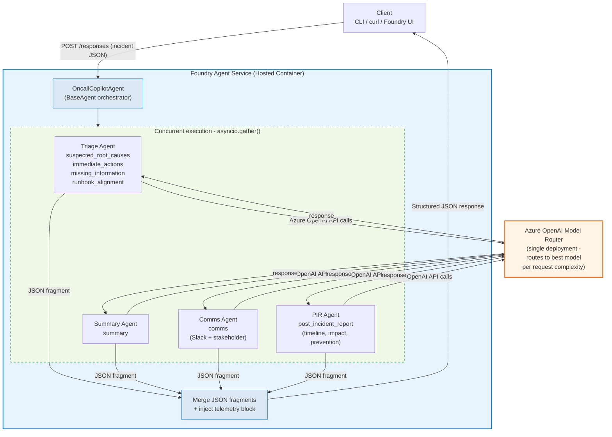

# On-Call Copilot: Multi-Agent Incident Triage and Post-Incident Report

A developer-ready sample demonstrating **Microsoft Agent Framework** with **Foundry Hosted Agents** and **Model Router**. Four specialist agents run **concurrently** to ingest incident signals (alerts, logs, metrics, runbook excerpts) and return structured triage plus a post-incident report draft, all as validated JSON.


> **Live demo video:** [docs/demo_ui.mp4](./docs/demo_ui.mp4)

## Architecture



## Excalidraw 


---

## UI Screenshots

The project includes a local browser UI (`ui/`) for interactive incident triage. Start it with:

```powershell
$env:AZURE_AI_PROJECT_ENDPOINT = "https://<account>.services.ai.azure.com/api/projects/<project>"
$env:AGENT_NAME = "oncall-copilot"
.\.venv-1\Scripts\python.exe ui\server.py
# Opens at http://localhost:7860
```

### Empty state — incident input panel with quick-load presets


### Quick-load presets — click any button to populate the JSON editor


### Incident loaded — editable JSON with severity badge and incident preview


### Full results — all four agent panels populated after a live invocation


### Triage panel — root causes with confidence bars and evidence


### Triage panel — immediate actions tab with priority badges


### Summary panel — narrative and ONGOING / RESOLVED status


### Comms panel — Slack card and stakeholder update


### Post-Incident Report — timeline dots and prevention actions


---

### Multi-Agent Design

| Agent | Responsibility | Output Keys |
|---|---|---|
| **Triage Agent** | Root cause analysis, immediate actions, missing info, runbook alignment | `suspected_root_causes`, `immediate_actions`, `missing_information`, `runbook_alignment` |
| **Summary Agent** | Concise incident summary | `summary` |
| **Comms Agent** | Slack update, stakeholder briefing | `comms` |
| **PIR Agent** | Post-incident timeline, customer impact, prevention actions | `post_incident_report` |

All four agents run **concurrently** via `asyncio.gather()` inside a custom `OncallCopilotAgent(BaseAgent)` orchestrator. Each specialist returns its own JSON section, which the orchestrator merges into a single structured response with a `telemetry` block.

### How It Works

1. **Request arrives** via the Responses API protocol (port 8088, handled by `azure.ai.agentserver.agentframework.from_agent_framework`)
2. **Orchestrator** (`OncallCopilotAgent.run()`) receives the incident payload
3. Four specialist agents are created via `AzureOpenAIChatClient.create_agent()`, each with dedicated instructions from `app/agents/`
4. All four are invoked **concurrently** via `asyncio.gather()` against Model Router
5. Each specialist returns a JSON fragment covering its output keys
6. The orchestrator **merges** all fragments into the unified output schema and injects a `telemetry` block
7. The merged JSON is returned as the agent response

### Key Dependencies

| Package | Purpose |
|---|---|
| `azure-ai-agentserver-agentframework` | Agent Framework hosting adapter + `BaseAgent`, `AzureOpenAIChatClient` |
| `azure-identity` | `DefaultAzureCredential` → bearer token provider for Azure OpenAI |
| `azure-ai-projects` | Legacy `AIProjectClient` used by `app/main.py` and `scripts/deploy_sdk.py` |

### Why Model Router?

This agent processes prompts of **mixed complexity**:

| Demo Scenario | Complexity | Model Router Benefit |
|---|---|---|
| Simple alert triage | Low: short context, pattern matching | Routes to a faster/cheaper model |
| Multi-signal correlation | High: logs + metrics + multiple alerts | Routes to a more capable model |
| Post-incident synthesis | High: long context, report generation | Routes to a high-capability model |

With Model Router as the **only** deployment, you get cost/latency optimization **without hardcoding model selection** in your code. One deployment name, zero model-selection logic.

---

## Repo Layout

```
On Call/
├── main.py                  # Agent Framework entrypoint (hosted agent)
├── app/
│   ├── agents/
│   │   ├── __init__.py
│   │   ├── triage.py        # Triage Agent instructions
│   │   ├── summary.py       # Summary Agent instructions
│   │   ├── comms.py         # Comms Agent instructions
│   │   └── pir.py           # PIR Agent instructions
│   ├── __init__.py
│   ├── main.py              # FastAPI server (legacy + mock mode)
│   ├── mock_router.py       # Mock model router for MOCK_MODE validation
│   ├── prompting.py         # Single-agent system prompt (legacy)
│   ├── schemas.py           # Input envelope & output JSON schemas
│   └── telemetry.py         # OpenTelemetry + structured logging
├── scripts/
│   ├── demos/               # 3 quick demo payloads (simple alert, multi-signal, post-incident)
│   ├── scenarios/           # 5 incident scenario JSON payloads
│   ├── golden_outputs/      # Expected triage responses for schema validation
│   ├── SCENARIOS.md         # Overview of all demos and scenarios
│   ├── validate.py          # End-to-end schema validation (MOCK_MODE)
│   ├── deploy_sdk.py        # Deploy agent to Foundry via Python SDK
│   ├── invoke.py            # Invoke the deployed Foundry agent
│   ├── run_scenarios.py     # Batch scenario runner against live Foundry API
│   ├── verify_agent.py      # Smoke-test the deployed agent
│   ├── get_logs.py          # Retrieve agent run logs from Foundry
│   └── test_local.*         # Local test scripts (http/sh/ps1)
├── infra/
│   └── main.bicep           # Azure infrastructure definition
├── agent.yaml               # Hosted Agent definition (multi-agent)
├── azure.yaml               # azd configuration
├── Dockerfile               # linux/amd64 container for Foundry
├── requirements.txt
├── LICENSE                  # MIT License
├── SECURITY.md              # Security policy and vulnerability reporting
├── CONTRIBUTING.md          # Contribution guide
└── README.md
```

---

## API Contract

### Input Envelope

```json
{
  "incident_id": "INC-20260217-001",
  "title": "API Gateway 5xx spike",
  "severity": "SEV1",
  "timeframe": { "start": "2026-02-17T03:42:00Z", "end": null },
  "alerts": [
    { "name": "HighErrorRate", "description": "...", "timestamp": "..." }
  ],
  "logs": [
    { "source": "order-service", "lines": ["ERROR ...", "WARN ..."] }
  ],
  "metrics": [
    { "name": "http_5xx_rate", "window": "5m", "values_summary": "..." }
  ],
  "runbook_excerpt": "Step 1: Check dashboard. Step 2: ...",
  "constraints": {
    "max_time_minutes": 15,
    "environment": "production",
    "region": "eastus2"
  }
}
```

### Output Schema (top-level keys)

```json
{
  "summary":               { "what_happened": "...", "current_status": "..." },
  "suspected_root_causes": [{ "hypothesis": "...", "evidence": [], "confidence": 0.0 }],
  "immediate_actions":     [{ "step": "...", "owner_role": "...", "priority": "P0" }],
  "missing_information":   [{ "question": "...", "why_it_matters": "..." }],
  "runbook_alignment":     { "matched_steps": [], "gaps": [] },
  "comms":                 { "slack_update": "...", "stakeholder_update": "..." },
  "post_incident_report":  { "timeline": [], "customer_impact": "...", "prevention_actions": [] },
  "telemetry":             { "correlation_id": "...", "model_router_deployment": "...", "selected_model_if_available": null, "tokens_if_available": null }
}
```

### Request to the agent (POST /responses)

Send the incident envelope directly as the JSON body:

```bash
curl -X POST http://localhost:8088/responses \
  -H "Content-Type: application/json" \
  -d @scripts/demos/demo_1_simple_alert.json
```

---

## Local Development

### Prerequisites

- Python 3.10+
- Docker Desktop (for containerized testing)
- A Microsoft Foundry project with Model Router deployed (for live mode)
- `AZURE_OPENAI_ENDPOINT` and `AZURE_OPENAI_CHAT_DEPLOYMENT_NAME` env vars set (for live mode)

### Run: Multi-Agent Mode (Agent Framework, requires Azure credentials)

This is the primary entrypoint. It starts the `OncallCopilotAgent` orchestrator via the Agent Framework hosting adapter on port 8088.

```bash
# 1. Create virtual environment
python -m venv .venv
# Windows:  .venv\Scripts\activate
# Linux/Mac: source .venv/bin/activate

# 2. Install dependencies
pip install -r requirements.txt

# 3. Set environment variables
# Windows PowerShell:
$env:AZURE_OPENAI_ENDPOINT="https://<account>.openai.azure.com/"
$env:AZURE_OPENAI_CHAT_DEPLOYMENT_NAME="model-router"

# Bash:
export AZURE_OPENAI_ENDPOINT="https://<account>.openai.azure.com/"
export AZURE_OPENAI_CHAT_DEPLOYMENT_NAME="model-router"

# 4. Start the multi-agent server
python main.py
# Hosting adapter listening on http://localhost:8088
```

### Run: Legacy/Mock Mode (FastAPI, no Azure credentials needed)

The FastAPI server in `app/main.py` supports `MOCK_MODE` for local validation without Azure. It uses the single-agent prompt and golden outputs.

```bash
# Start server with mock golden responses
# Windows PowerShell:
$env:MOCK_MODE="true"
python -m app.main

# Bash:
MOCK_MODE=true python -m app.main
```

### Validate All Scenarios (Mock Mode)

```bash
# Starts server automatically, sends all 5 scenarios, validates output schemas
python scripts/validate.py

# Run a specific scenario only
python scripts/validate.py --scenario 2
```

### Invoke the Deployed Agent (Live Mode)

```bash
# Set required env vars first (see Environment Variables table above)

# Send the default CPU alert prompt
python scripts/invoke.py

# Send a custom prompt
python scripts/invoke.py --prompt "db connection pool exhausted on orders-db-primary"

# Send one of the built-in demos
python scripts/invoke.py --demo 1
python scripts/invoke.py --demo 2

# Send one of the built-in scenarios
python scripts/invoke.py --scenario 2
```

### Run All Scenarios Against Live Foundry API

```bash
# Run all 5 scenarios and validate output structure
python scripts/run_scenarios.py

# Run a single scenario
python scripts/run_scenarios.py --scenario 3

# List available scenarios
python scripts/run_scenarios.py --list
```

#### Scenario Files

Each scenario is a self-contained JSON file. To try a scenario in the **Foundry Agent Playground**, open the file, copy the full JSON, and paste it into the chat input.

| # | File | Severity | Description |
|---|------|----------|-------------|
| 1 | [scenario_1_redis_outage.json](scripts/scenarios/scenario_1_redis_outage.json) | SEV2 | Redis cache cluster unresponsive, session service returning 503s |
| 2 | [scenario_2_aks_scaling.json](scripts/scenarios/scenario_2_aks_scaling.json) | SEV1 | Kubernetes node pool scaling failure, pod scheduling backlog |
| 3 | [scenario_3_dns_cascade.json](scripts/scenarios/scenario_3_dns_cascade.json) | SEV1 | DNS resolution failures causing cascading microservice timeouts |
| 4 | [scenario_4_minimal_alert.json](scripts/scenarios/scenario_4_minimal_alert.json) | SEV4 | Minimal CPU alert on staging batch processor |
| 5 | [scenario_5_storage_throttle_pir.json](scripts/scenarios/scenario_5_storage_throttle_pir.json) | SEV2 | Resolved: storage throttling caused image upload failures (post-incident review) |

### Verify the Deployed Agent Health

```bash
python scripts/verify_agent.py
```

### Test (Manual)

```bash
# Bash
bash scripts/test_local.sh 1   # simple alert
bash scripts/test_local.sh 2   # multi-signal
bash scripts/test_local.sh 3   # post-incident

# PowerShell
.\scripts\test_local.ps1 -Demo 1
```

Or use the [test_local.http](scripts/test_local.http) file with the VS Code REST Client extension.

---

## Deploy to Foundry Agent Service

> Ref: [Deploy a hosted agent](https://learn.microsoft.com/azure/ai-foundry/agents/how-to/deploy-hosted-agent?view=foundry&tabs=bash)

### Prerequisites

- Azure CLI 2.80+ and Azure Developer CLI (azd) 1.23.0+
- Docker Desktop
- A Microsoft Foundry project
- Required permissions (see [docs](https://learn.microsoft.com/azure/ai-foundry/agents/how-to/deploy-hosted-agent?view=foundry&tabs=bash#prerequisites))

### Option A: Azure Developer CLI (fastest path)

```bash
# 1. Initialize project from starter template (first time)
azd init -t https://github.com/Azure-Samples/azd-ai-starter-basic

# Or, if you have an existing Foundry project:
azd ai agent init --project-id /subscriptions/<SUB_ID>/resourceGroups/<RG>/providers/Microsoft.CognitiveServices/accounts/<ACCOUNT>/projects/<PROJECT>

# 2. Point azd at the agent.yaml
azd ai agent init -m agent.yaml

# 3. Deploy (builds container, pushes to ACR, creates Hosted Agent)
azd up

# 4. Verify deployment
az cognitiveservices agent show \
    --account-name <your-account-name> \
    --project-name <your-project-name> \
    --name oncall-copilot
# Success: status = "Started"

# 5. Clean up when done
azd down
```

### Option B: Python SDK (CI/CD integration)

```bash
# 1. Build Docker image (must be linux/amd64 for Foundry)
docker build --platform linux/amd64 -t oncall-copilot:v1 .

# 2. Push to Azure Container Registry
az acr login --name <your-registry>
docker tag oncall-copilot:v1 <your-registry>.azurecr.io/oncall-copilot:v1
docker push <your-registry>.azurecr.io/oncall-copilot:v1

# 3. Grant project managed identity access to pull images
#    In Azure Portal → Foundry project → Identity → copy Object (principal) ID
#    Assign "Container Registry Repository Reader" role on your ACR

# 4. Create account-level capability host (one-time setup)
az rest --method put \
    --url "https://management.azure.com/subscriptions/<SUB_ID>/resourceGroups/<RG>/providers/Microsoft.CognitiveServices/accounts/<ACCOUNT>/capabilityHosts/accountcaphost?api-version=2025-10-01-preview" \
    --headers "content-type=application/json" \
    --body '{
        "properties": {
            "capabilityHostKind": "Agents",
            "enablePublicHostingEnvironment": true
        }
    }'

# 5. Deploy using the SDK script
export AZURE_AI_PROJECT_ENDPOINT="https://<account>.services.ai.azure.com/api/projects/<project>"
export ACR_IMAGE="<your-registry>.azurecr.io/oncall-copilot:v1"
export MODEL_ROUTER_DEPLOYMENT="model-router"

python scripts/deploy_sdk.py

# 6. Verify
az cognitiveservices agent show \
    --account-name <your-account-name> \
    --project-name <your-project-name> \
    --name oncall-copilot

# 7. Clean up
python scripts/deploy_sdk.py --delete
```

### Environment Variables

| Variable | Required | Description |
|---|---|---|
| `AZURE_OPENAI_ENDPOINT` | Yes | Azure OpenAI endpoint used by Agent Framework `AzureOpenAIChatClient` |
| `AZURE_OPENAI_CHAT_DEPLOYMENT_NAME` | Yes | Model Router deployment name (e.g. `model-router`) |
| `AZURE_AI_PROJECT_ENDPOINT` | Yes | Foundry project endpoint URL (`https://<account>.services.ai.azure.com/api/projects/<project>`) |
| `AGENT_NAME` | No | Agent name to target for SDK scripts (default: `oncall-copilot`) |
| `AGENT_VERSION` | No | Agent version to target for SDK scripts (default: `latest`) |
| `MODEL_ROUTER_DEPLOYMENT` | No | Alias for deployment name (legacy FastAPI mode) |
| `ACR_IMAGE` | No | ACR image URI used by `deploy_sdk.py` (e.g. `myregistry.azurecr.io/oncall-copilot:v1`) |
| `MOCK_MODE` | No | Set to `true` for local validation without Azure (legacy mode only) |
| `LOG_LEVEL` | No | Logging level (default: `INFO`) |

---

## Demo Script

### Demo 1: Simple Alert (Quick Triage)

**Payload file:** [scripts/demos/demo_1_simple_alert.json](scripts/demos/demo_1_simple_alert.json)

> **Agent playground:** Open the file, copy the full JSON, and paste it directly into the chat input in the Foundry Agent Playground.

**Input:** Single 5xx-rate alert, one metric, runbook excerpt. Minimal context.

**Model Router value:** Low complexity → routes to a fast, cost-efficient model.

**Expected output shape:**
```json
{
  "summary": { "what_happened": "...", "current_status": "..." },
  "suspected_root_causes": [{ "hypothesis": "...", "evidence": ["..."], "confidence": 0.6 }],
  "immediate_actions": [{ "step": "Check API GW dashboard", "owner_role": "oncall-eng", "priority": "P1" }],
  "missing_information": [{ "question": "Are downstream services healthy?", "why_it_matters": "..." }],
  "runbook_alignment": { "matched_steps": ["Step 1"], "gaps": ["No step for rollback"] },
  "comms": { "slack_update": "...", "stakeholder_update": "..." },
  "post_incident_report": { "timeline": [...], "customer_impact": "...", "prevention_actions": [...] },
  "telemetry": { "correlation_id": "...", "model_router_deployment": "model-router", ... }
}
```

### Demo 2: Multi-Signal Incident (Logs and Metrics Correlation)

**Payload file:** [scripts/demos/demo_2_multi_signal.json](scripts/demos/demo_2_multi_signal.json)

> **Agent playground:** Open the file, copy the full JSON, and paste it directly into the chat input in the Foundry Agent Playground.

**Input:** 3 alerts, 2 log sources, 3 metrics, detailed runbook. DB connection pool exhaustion + OOM.

**Model Router value:** High complexity, multi-source correlation → routes to a highly capable model.

**Expected output shape:**
```json
{
  "summary": { "what_happened": "...", "current_status": "..." },
  "suspected_root_causes": [
    { "hypothesis": "DB connection pool exhaustion", "evidence": ["...","..."], "confidence": 0.85 },
    { "hypothesis": "Memory leak in order-worker", "evidence": ["..."], "confidence": 0.7 }
  ],
  "immediate_actions": [
    { "step": "Scale DB max_connections", "owner_role": "dba", "priority": "P0" },
    { "step": "Restart order-worker pods", "owner_role": "oncall-eng", "priority": "P0" },
    { "step": "Enable read replica failover", "owner_role": "dba", "priority": "P1" }
  ],
  "missing_information": [...],
  "runbook_alignment": { "matched_steps": ["Step 1","Step 2","Step 3"], "gaps": [...] },
  "comms": { "slack_update": "...", "stakeholder_update": "..." },
  "post_incident_report": { "timeline": [...], "customer_impact": "...", "prevention_actions": [...] },
  "telemetry": { ... }
}
```

### Demo 3: Post-Incident Report Synthesis

**Payload file:** [scripts/demos/demo_3_post_incident.json](scripts/demos/demo_3_post_incident.json)

> **Agent playground:** Open the file, copy the full JSON, and paste it directly into the chat input in the Foundry Agent Playground.

**Input:** Resolved SEV1 (TLS cert expiry), 4 alerts, 2 log sources, 4 metrics including revenue impact. Full timeline.

**Model Router value:** Long context, narrative synthesis → routes to a high-capability model.

**Expected output shape:**
```json
{
  "summary": { "what_happened": "...", "current_status": "Resolved" },
  "suspected_root_causes": [
    { "hypothesis": "Expired TLS certificate for *.auth.contoso.com", "evidence": ["...","...","..."], "confidence": 0.98 }
  ],
  "immediate_actions": [
    { "step": "Implement automated cert renewal monitoring", "owner_role": "platform-eng", "priority": "P1" }
  ],
  "missing_information": [
    { "question": "Why was cert expiry not caught by monitoring?", "why_it_matters": "..." }
  ],
  "runbook_alignment": { "matched_steps": ["Step 1","Step 2","Step 3","Step 4"], "gaps": ["Automated cert renewal"] },
  "comms": { "slack_update": "...", "stakeholder_update": "..." },
  "post_incident_report": {
    "timeline": [
      { "time": "14:00Z", "event": "TLS cert expired" },
      { "time": "14:02Z", "event": "Auth failure alerts fired" },
      { "time": "14:45Z", "event": "Emergency cert rotation initiated" },
      { "time": "16:35Z", "event": "Full recovery confirmed" }
    ],
    "customer_impact": "~2.5 hours of auth failures, est. $340k lost transactions",
    "prevention_actions": ["Automated cert renewal", "Cert expiry alerting at 30/14/7 days", "..."]
  },
  "telemetry": { ... }
}
```

---

## Observability

| Signal | Implementation |
|---|---|
| **Structured logs** | JSON-formatted via Python `logging`; every request logs `correlation_id`, `incident_id`, `severity` |
| **Correlation IDs** | UUID generated per request, returned in `X-Correlation-ID` header and in output `telemetry` block |
| **OTel spans** | Spans around `handle_responses`, `validate_input`, `call_model_router`, `validate_output` |
| **OTLP export** | Set `OTEL_EXPORTER_OTLP_ENDPOINT` to ship traces to Jaeger, Azure Monitor, etc. |

## Guardrails

- **Secret redaction**: regex-based scrubbing of credential-like patterns before they reach the model
- **No sensitive data in logs**: startup logs print only safe configuration values; managed identity secrets (`MSI_SECRET`, `IDENTITY_ENDPOINT`) are never written to output
- **No hallucination**: system prompt instructs the model to set `confidence: 0` and populate `missing_information` when data is insufficient
- **Mark unknowns**: uses literal `"UNKNOWN"` for undeterminable fields
- **JSON-only output**: `response_format: json_object` with schema validation and fallback
- **Diagnostic suggestions**: when data is sparse, `immediate_actions` includes diagnostic steps

---

## Troubleshooting

| Error | HTTP | Fix |
|---|---|---|
| `SubscriptionIsNotRegistered` | 400 | Register the subscription provider |
| `InvalidAcrPullCredentials` | 401 | Fix managed identity or registry RBAC |
| `UnauthorizedAcrPull` | 403 | Assign `Container Registry Repository Reader` to project identity |
| `AcrImageNotFound` | 404 | Correct image name/tag or push image to ACR |
| `RegistryNotFound` | 400/404 | Fix registry DNS or network reachability |
| Gateway returns 400 "ID cannot be null" | 400 | Foundry gateway rejects prompts that match `"Title: CapName."` (capital name + trailing period). Use lowercase names without a trailing period in incident prompts. |

For 5xx errors during deployment, contact Microsoft support. For local validation issues, run `python scripts/validate.py` with `MOCK_MODE=true`.

---

## Contributing

See [CONTRIBUTING.md](CONTRIBUTING.md) for development setup, code style guidelines, how to add new scenarios and agents, and the pull request checklist.

## Security

See [SECURITY.md](SECURITY.md) for the security policy and how to report a vulnerability.

## License

MIT; see [LICENSE](LICENSE) for details.
