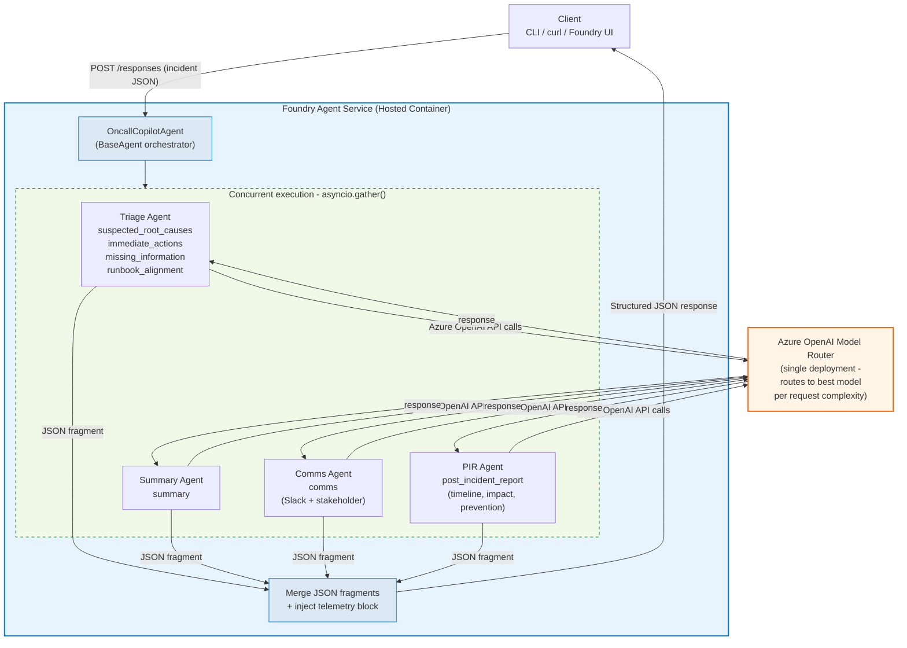
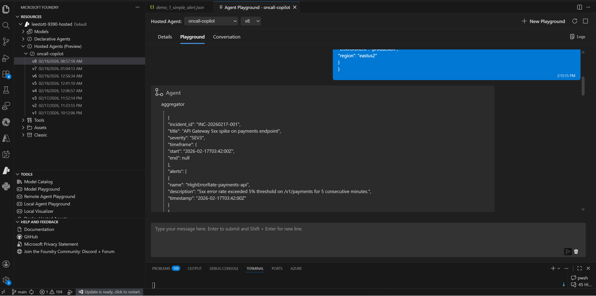

# On-Call Copilot: Multi-Agent Incident Triage

A developer-ready sample demonstrating **Microsoft Agent Framework** with **Foundry Hosted Agents** and **Model Router**. Four specialist agents run **concurrently** to triage incident signals (alerts, logs, metrics, runbook excerpts) and produce structured JSON output — including root-cause analysis, immediate actions, communications drafts, and a post-incident report.


> **Live demo video:** [docs/demo_ui.mp4](./docs/demo_ui.mp4)

---

## Quick Start

Get the sample running locally in under 5 minutes.

### 1. Prerequisites

| Tool | Required | Install |
|------|----------|---------|
| **Python 3.10+** | Yes | [python.org](https://www.python.org/downloads/) |
| **Azure CLI** (`az`) | Yes | [Install Azure CLI](https://learn.microsoft.com/cli/azure/install-azure-cli) |
| **Azure Foundry project** | Yes | [Create a Foundry project](https://learn.microsoft.com/azure/ai-foundry/how-to/create-projects) |
| **Model Router deployment** | Yes | [Deploy Model Router](https://learn.microsoft.com/azure/ai-foundry/openai/how-to/model-router) |
| **Docker Desktop** | For deployment only | [docker.com](https://www.docker.com/products/docker-desktop/) |

### 2. Clone and set up

```bash
git clone https://github.com/Azure-Samples/On-Call-Copilot-Multi-Agent.git
cd On-Call-Copilot-Multi-Agent

python -m venv .venv
```

Activate the virtual environment:

```bash
# Windows PowerShell
.venv\Scripts\Activate.ps1

# Windows cmd
.venv\Scripts\activate.bat

# Linux / macOS
source .venv/bin/activate
```

Install dependencies:

```bash
pip install -r requirements.txt
```

### 3. Configure environment variables

Copy the template and fill in your Azure values:

```bash
# Linux / macOS
cp .env.example .env

# Windows
copy .env.example .env
```

Open `.env` and set the four required variables:

```dotenv
AZURE_OPENAI_ENDPOINT=https://<your-resource>.openai.azure.com/
AZURE_OPENAI_API_KEY=<your-api-key>
AZURE_OPENAI_CHAT_DEPLOYMENT_NAME=model-router
AZURE_AI_PROJECT_ENDPOINT=https://<account>.services.ai.azure.com/api/projects/<project>
```

> **Where to find these values:**
>
> | Variable | Location in Azure Portal |
> |----------|--------------------------|
> | `AZURE_OPENAI_ENDPOINT` | AI Services resource → Overview → Endpoint |
> | `AZURE_OPENAI_API_KEY` | AI Services resource → Keys and Endpoint |
> | `AZURE_OPENAI_CHAT_DEPLOYMENT_NAME` | Microsoft Foundry → Deployments (usually `model-router`) |
> | `AZURE_AI_PROJECT_ENDPOINT` | Microsoft Foundry → project → Overview → Endpoint |
>
> `.env` is in `.gitignore` — your credentials will not be committed.

### 4. Sign in to Azure

```bash
az login
```

> If you have multiple subscriptions, select the correct one:
> ```bash
> az account set --subscription "<your-subscription-name-or-id>"
> ```

### 5. Run the agent server

```bash
python main.py
# Listening on http://localhost:8088
```

### 6. Run the browser UI (optional)

In a **second terminal** (with the venv activated):

```bash
python ui/server.py
# Opens at http://localhost:7860
```

The UI lets you load sample incidents, send them to the agent, and view results across all four agent panels.

### 7. Test with a sample incident

```bash
# curl — send a demo payload
curl -X POST http://localhost:8088/responses \
  -H "Content-Type: application/json" \
  -d @scripts/demos/demo_1_simple_alert.json

# PowerShell
.\scripts\test_local.ps1 -Demo 1

# Bash
bash scripts/test_local.sh 1
```

Or use [scripts/test_local.http](scripts/test_local.http) with the VS Code REST Client extension.

---

## How It Works




### Request flow

1. **Request arrives** via the Responses API protocol (port 8088)
2. **Orchestrator** (`OncallCopilotAgent.run()`) receives the incident payload
3. Four specialist agents are created, each with dedicated instructions from `app/agents/`
4. All four are invoked **concurrently** via `asyncio.gather()` against Model Router
5. Each specialist returns a JSON fragment covering its output keys
6. The orchestrator **merges** all fragments and injects a `telemetry` block
7. The merged JSON is returned as the response

### Multi-Agent Design

| Agent | Responsibility | Output Keys |
|---|---|---|
| **Triage** | Root cause analysis, immediate actions, missing info, runbook alignment | `suspected_root_causes`, `immediate_actions`, `missing_information`, `runbook_alignment` |
| **Summary** | Concise incident narrative | `summary` |
| **Comms** | Slack update, stakeholder briefing | `comms` |
| **PIR** | Post-incident timeline, customer impact, prevention actions | `post_incident_report` |

### Why Model Router?

Model Router automatically routes each request to the best model based on complexity — no model-selection logic needed in your code:

| Scenario | Complexity | Routing |
|---|---|---|
| Simple alert triage | Low | Faster, cheaper model |
| Multi-signal correlation | High | More capable model |
| Post-incident synthesis | High | High-capability model |

---

## Running Modes

### Multi-Agent Mode (default)

Uses the Agent Framework with four concurrent agents. Requires Azure credentials.

```bash
python main.py
# http://localhost:8088
```

### Mock Mode (no Azure credentials needed)

Uses the FastAPI server with golden outputs for local schema validation:

```bash
# Windows PowerShell
$env:MOCK_MODE="true"; python -m app.main

# Linux / macOS
MOCK_MODE=true python -m app.main
```

### Validate All Scenarios (Mock Mode)

```bash
python scripts/validate.py                # all 5 scenarios
python scripts/validate.py --scenario 2   # single scenario
```

---

## Scenarios and Demos

### Demo Payloads

| # | File | Description |
|---|------|-------------|
| 1 | `scripts/demos/demo_1_simple_alert.json` | Single 5xx alert — quick triage |
| 2 | `scripts/demos/demo_2_multi_signal.json` | 3 alerts + logs + metrics — multi-signal correlation |
| 3 | `scripts/demos/demo_3_post_incident.json` | Resolved SEV1 TLS cert expiry — full PIR synthesis |

### Scenario Payloads

| # | File | Severity | Description |
|---|------|----------|-------------|
| 1 | [scenario_1_redis_outage.json](scripts/scenarios/scenario_1_redis_outage.json) | SEV2 | Redis cache cluster unresponsive |
| 2 | [scenario_2_aks_scaling.json](scripts/scenarios/scenario_2_aks_scaling.json) | SEV1 | Kubernetes node pool scaling failure |
| 3 | [scenario_3_dns_cascade.json](scripts/scenarios/scenario_3_dns_cascade.json) | SEV1 | DNS resolution failures cascading |
| 4 | [scenario_4_minimal_alert.json](scripts/scenarios/scenario_4_minimal_alert.json) | SEV4 | Minimal CPU alert on staging |
| 5 | [scenario_5_storage_throttle_pir.json](scripts/scenarios/scenario_5_storage_throttle_pir.json) | SEV2 | Storage throttling — post-incident review |

### Running scenarios against a deployed agent

```bash
python scripts/invoke.py                                         # default prompt
python scripts/invoke.py --demo 1                                # built-in demo
python scripts/invoke.py --scenario 2                            # built-in scenario
python scripts/invoke.py --prompt "db connection pool exhausted"  # custom prompt

python scripts/run_scenarios.py            # all scenarios
python scripts/run_scenarios.py --list     # list available
python scripts/run_scenarios.py --scenario 3  # single scenario
```

---

## API Contract

### Input Envelope

```json
{
  "incident_id": "INC-20260217-001",
  "title": "API Gateway 5xx spike",
  "severity": "SEV1",
  "timeframe": { "start": "2026-02-17T03:42:00Z", "end": null },
  "alerts": [
    { "name": "HighErrorRate", "description": "...", "timestamp": "..." }
  ],
  "logs": [
    { "source": "order-service", "lines": ["ERROR ...", "WARN ..."] }
  ],
  "metrics": [
    { "name": "http_5xx_rate", "window": "5m", "values_summary": "..." }
  ],
  "runbook_excerpt": "Step 1: Check dashboard. Step 2: ...",
  "constraints": {
    "max_time_minutes": 15,
    "environment": "production",
    "region": "eastus2"
  }
}
```

### Output Schema

```json
{
  "summary":               { "what_happened": "...", "current_status": "..." },
  "suspected_root_causes": [{ "hypothesis": "...", "evidence": [], "confidence": 0.0 }],
  "immediate_actions":     [{ "step": "...", "owner_role": "...", "priority": "P0" }],
  "missing_information":   [{ "question": "...", "why_it_matters": "..." }],
  "runbook_alignment":     { "matched_steps": [], "gaps": [] },
  "comms":                 { "slack_update": "...", "stakeholder_update": "..." },
  "post_incident_report":  { "timeline": [], "customer_impact": "...", "prevention_actions": [] },
  "telemetry":             { "correlation_id": "...", "model_router_deployment": "...", "selected_model_if_available": null, "tokens_if_available": null }
}
```

---

## Deploy to Azure Foundry

> For a comprehensive step-by-step deployment guide, see [Hosting_Agent.md](Hosting_Agent.md).
>
> Ref: [Deploy a hosted agent](https://learn.microsoft.com/azure/ai-foundry/agents/how-to/deploy-hosted-agent?view=foundry&tabs=bash)

### Deploy prerequisites

- Azure CLI 2.80+ and Azure Developer CLI (`azd`) 1.23.0+
- Docker Desktop
- A Microsoft Foundry project with required permissions ([details](https://learn.microsoft.com/azure/ai-foundry/agents/how-to/deploy-hosted-agent?view=foundry&tabs=bash#prerequisites))

### Option A: Azure Developer CLI (fastest)

```bash
azd init -t https://github.com/Azure-Samples/azd-ai-starter-basic
azd ai agent init -m agent.yaml
azd up
```

Verify:

```bash
az cognitiveservices agent show \
    --account-name <your-account-name> \
    --project-name <your-project-name> \
    --name oncall-copilot
```

Clean up: `azd down`

### Option B: Python SDK (CI/CD integration)

```bash
# 1. Build and push container image
docker build --platform linux/amd64 -t oncall-copilot:v1 .
az acr login --name <your-registry>
docker tag oncall-copilot:v1 <your-registry>.azurecr.io/oncall-copilot:v1
docker push <your-registry>.azurecr.io/oncall-copilot:v1

# 2. Grant project managed identity "Container Registry Repository Reader" on your ACR

# 3. Deploy
export ACR_IMAGE="<your-registry>.azurecr.io/oncall-copilot:v1"
python scripts/deploy_sdk.py

# 4. Verify
python scripts/verify_agent.py

# Clean up
python scripts/deploy_sdk.py --delete
```

---

## Using the Foundry Agent Playground (VS Code)

1. Install the **Microsoft Foundry** extension (Extensions view → search "Microsoft Foundry" → Install)
2. Open Command Palette (`Ctrl+Shift+P`) → **Microsoft Foundry: Set Default Project**
3. Sign in and select your subscription, resource group, and Foundry project
4. Open any demo/scenario JSON file, copy the contents, and paste into the Foundry Agent Playground chat



---

## UI Screenshots

<details>
<summary>Click to expand UI screenshots</summary>

### Empty state — incident input panel with quick-load presets


### Quick-load presets


### Incident loaded — editable JSON with severity badge


### Full results — all four agent panels


### Triage — root causes with confidence bars


### Triage — immediate actions


### Summary — narrative and status


### Comms — Slack card and stakeholder update


### Post-Incident Report — timeline and prevention actions


</details>

---

## Environment Variables

| Variable | Required | Description |
|---|---|---|
| `AZURE_OPENAI_ENDPOINT` | Yes | Azure OpenAI / AI Services endpoint |
| `AZURE_OPENAI_API_KEY` | Yes | API key (Azure Portal → Keys and Endpoint) |
| `AZURE_OPENAI_CHAT_DEPLOYMENT_NAME` | Yes | Model Router deployment name (e.g. `model-router`) |
| `AZURE_AI_PROJECT_ENDPOINT` | Yes | Foundry project endpoint (`https://<account>.services.ai.azure.com/api/projects/<project>`) |
| `AGENT_NAME` | No | Agent name for SDK scripts (default: `oncall-copilot`) |
| `AGENT_VERSION` | No | Agent version for SDK scripts (default: `latest`) |
| `ACR_IMAGE` | No | ACR image URI for `deploy_sdk.py` |
| `MOCK_MODE` | No | Set to `true` for mock validation without Azure |
| `LOG_LEVEL` | No | Logging level (default: `INFO`) |

---

## Repo Layout

```
On-Call-Copilot-Multi-Agent/
├── main.py                  # Agent Framework entrypoint (hosted agent)
├── agent.yaml               # Hosted Agent definition
├── azure.yaml               # azd configuration
├── Dockerfile               # linux/amd64 container for Foundry
├── requirements.txt
├── .env.example             # Environment variable template → copy to .env
├── app/
│   ├── agents/
│   │   ├── triage.py        # Triage Agent instructions
│   │   ├── summary.py       # Summary Agent instructions
│   │   ├── comms.py         # Comms Agent instructions
│   │   └── pir.py           # PIR Agent instructions
│   ├── main.py              # FastAPI server (mock mode)
│   ├── mock_router.py       # Mock model router for validation
│   ├── schemas.py           # Input/output JSON schemas
│   └── telemetry.py         # OpenTelemetry + structured logging
├── scripts/
│   ├── demos/               # 3 demo payloads
│   ├── scenarios/           # 5 incident scenarios
│   ├── golden_outputs/      # Expected outputs for schema validation
│   ├── validate.py          # Schema validation (mock mode)
│   ├── deploy_sdk.py        # Deploy agent via Python SDK
│   ├── invoke.py            # Invoke deployed agent
│   ├── run_scenarios.py     # Batch scenario runner
│   ├── verify_agent.py      # Deployment health check
│   └── test_local.*         # Local test scripts (http/sh/ps1)
├── ui/
│   ├── index.html           # Browser UI
│   └── server.py            # UI server (port 7860)
├── infra/
│   └── main.bicep           # Azure infrastructure (Bicep)
└── docs/                    # Architecture diagrams, screenshots, blog post
```

---

## Key Dependencies

| Package | Purpose |
|---|---|
| `azure-ai-agentserver-agentframework` | Agent Framework hosting + `BaseAgent`, `AzureOpenAIChatClient` |
| `azure-identity` | `DefaultAzureCredential` for Azure OpenAI bearer tokens |
| `python-dotenv` | Auto-load `.env` file at startup |

### Learn More

- [Microsoft Agent Framework](https://learn.microsoft.com/agent-framework/)
- [Model Router](https://learn.microsoft.com/azure/ai-foundry/openai/how-to/model-router)
- [Hosted Agents](https://learn.microsoft.com/azure/ai-foundry/agents/concepts/hosted-agents)

---

## Observability

| Signal | Implementation |
|---|---|
| **Structured logs** | JSON via Python `logging`; each request logs `correlation_id`, `incident_id`, `severity` |
| **Correlation IDs** | UUID per request, in `X-Correlation-ID` header and output `telemetry` block |
| **OTel spans** | Spans around `handle_responses`, `validate_input`, `call_model_router`, `validate_output` |
| **OTLP export** | Set `OTEL_EXPORTER_OTLP_ENDPOINT` to ship traces to Jaeger / Azure Monitor |

## Guardrails

- **Secret redaction** — regex-based scrubbing of credential patterns before they reach the model
- **No hallucination** — system prompt sets `confidence: 0` and populates `missing_information` when data is insufficient
- **JSON-only output** — `response_format: json_object` with schema validation and fallback
- **Unknowns marked** — literal `"UNKNOWN"` for undeterminable fields

---

## Troubleshooting

| Error | HTTP | Fix |
|---|---|---|
| `SubscriptionIsNotRegistered` | 400 | Register the subscription provider |
| `InvalidAcrPullCredentials` | 401 | Fix managed identity or registry RBAC |
| `UnauthorizedAcrPull` | 403 | Assign `Container Registry Repository Reader` to project identity |
| `AcrImageNotFound` | 404 | Correct image name/tag or push image to ACR |
| `RegistryNotFound` | 400/404 | Fix registry DNS or network reachability |
| Gateway 400 "ID cannot be null" | 400 | Avoid `"Title: CapName."` pattern in prompts |

For local validation issues, run `python scripts/validate.py` with `MOCK_MODE=true`.

---

## Contributing

See [CONTRIBUTING.md](CONTRIBUTING.md) for development setup, code style guidelines, and the PR checklist.

## Security

See [SECURITY.md](SECURITY.md) for the security policy and how to report a vulnerability.

## License

MIT — see [LICENSE](LICENSE).
