# Building an On-Call Copilot with Microsoft Agent Framework: Four AI Agents, One Incident Response

*February 2026 · Lee Stott, Microsoft*

---

When an incident fires at 3 am, every second the on-call engineer spends piecing together alerts, logs, and metrics is a second not spent fixing the problem. This post walks through how we built **On-Call Copilot**: a multi-agent AI system that ingests raw incident signals and returns structured triage, a Slack update, a stakeholder brief, and a draft post-incident report in under 10 seconds.

The full sample code is at [github.com/microsoft-foundry/oncall-copilot](https://github.com/microsoft-foundry/oncall-copilot). Deploy it to your own Foundry project with a single `azd up`.

---

## The Problem with Single-Agent Triage

Early AI incident assistants used a single large prompt: *"Here is the incident. Give me root causes, actions, a Slack message, and a post-incident report."* This approach suffers from two problems:

1. **Context overload.** A real incident may have 800 lines of logs, 10 alert lines, and dense metrics. Asking one model to process everything and produce four distinct output formats in a single turn pushes token limits and degrades output quality.
2. **Conflicting concerns.** Triage reasoning and communication drafting are cognitively different tasks. A model optimised for structured JSON analysis often produces stilted Slack messages, and vice versa.

The fix is specialisation: decompose the task into focused agents and run them in parallel.

---

## Architecture

On-Call Copilot is deployed as a **Foundry Hosted Agent**, a containerised Python service that runs on Azure AI Foundry's managed infrastructure. The core orchestrator uses `ConcurrentBuilder` from the Microsoft Agent Framework SDK to run four specialist agents in parallel via `asyncio.gather()`.


```
Client (CLI / curl / browser UI)
        │
        │  POST /responses  (incident JSON)
        ▼
┌───────────────────────────────────────────────────────────────┐
│                    Foundry Hosted Agent                       │
│                                                               │
│  OncallCopilotAgent (ConcurrentBuilder orchestrator)          │
│                                                               │
│   ┌─────────────┐  ┌──────────────┐  ┌────────┐  ┌───────┐    │
│   │ Triage      │  │ Summary      │  │ Comms  │  │ PIR   │    │
│   │ Agent       │  │ Agent        │  │ Agent  │  │ Agent │    │
│   └──────┬──────┘  └──────┬───────┘  └───┬────┘  └───┬───┘    │
│          └────────────────┴──────────────┴────────────┘       │
│                         asyncio.gather()                      │
│                              │                                │
│                         Merge JSON fragments                  │
└───────────────────────────────────────────────────────────────┘
        │
        │  Microsoft Foundry Model Router
        │  (routes each call to the best model for that complexity)
        ▼
   Structured JSON response
```

All four agents share a single Azure OpenAI **Model Router** deployment. This is important: rather than hardcoding `gpt-4o` or `gpt-4o-mini` for each agent, Model Router analyses the request complexity and routes automatically. A simple triage prompt costs less; a long post-incident synthesis uses a more capable model. One deployment name, zero model-selection code.

---

## The Code

### Orchestrator (`main.py`)

The entry point is remarkably concise. `ConcurrentBuilder` handles all the async wiring:

```python
from agent_framework import ConcurrentBuilder
from agent_framework.azure import AzureOpenAIChatClient
from azure.ai.agentserver.agentframework import from_agent_framework
from azure.identity import DefaultAzureCredential, get_bearer_token_provider

_credential = DefaultAzureCredential()
_token_provider = get_bearer_token_provider(
    _credential, "https://cognitiveservices.azure.com/.default"
)

def create_workflow_builder():
    triage = AzureOpenAIChatClient(ad_token_provider=_token_provider).create_agent(
        instructions=TRIAGE_INSTRUCTIONS,
        name="triage-agent",
    )
    summary = AzureOpenAIChatClient(ad_token_provider=_token_provider).create_agent(
        instructions=SUMMARY_INSTRUCTIONS,
        name="summary-agent",
    )
    comms = AzureOpenAIChatClient(ad_token_provider=_token_provider).create_agent(
        instructions=COMMS_INSTRUCTIONS,
        name="comms-agent",
    )
    pir = AzureOpenAIChatClient(ad_token_provider=_token_provider).create_agent(
        instructions=PIR_INSTRUCTIONS,
        name="pir-agent",
    )
    return ConcurrentBuilder().participants([triage, summary, comms, pir])

def main():
    builder = create_workflow_builder()
    from_agent_framework(builder.build).run()  # starts on port 8088
```

`DefaultAzureCredential` means the container uses managed identity in production and your local `az login` session in development; no secrets, no key rotation.

### Agent Instructions

Each agent receives a tightly scoped system prompt. Here is the Triage Agent, which is responsible for root cause analysis only:

```python
TRIAGE_INSTRUCTIONS = """
You are the Triage Agent, an expert SRE specialising in root cause analysis.

## Task
Analyse the incident data and return a single JSON object with ONLY these keys:

{
  "suspected_root_causes": [
    {
      "hypothesis": "concise root cause hypothesis",
      "evidence": ["supporting evidence from the input"],
      "confidence": 0.87
    }
  ],
  "immediate_actions": [
    {
      "step": "concrete action with runnable command if applicable",
      "owner_role": "oncall-eng | dba | infra-eng | platform-eng",
      "priority": "P0 | P1 | P2 | P3"
    }
  ],
  "missing_information": [
    {
      "question": "what data is missing",
      "why_it_matters": "why this data would help"
    }
  ],
  "runbook_alignment": {
    "matched_steps": ["runbook steps that match the situation"],
    "gaps": ["gaps or missing runbook coverage"]
  }
}

## Guardrails
- No hallucination: if data is insufficient, set confidence to 0 and populate missing_information
- No secrets: redact credential-like material as [REDACTED]
- Structured output only: return ONLY valid JSON, no prose
"""
```

The other three agents follow the same pattern, each owning their section of the output schema:

| Agent | Output keys | What it does |
|---|---|---|
| **Triage** | `suspected_root_causes`, `immediate_actions`, `missing_information`, `runbook_alignment` | Root cause analysis, immediate response steps |
| **Summary** | `summary.what_happened`, `summary.current_status` | Plain-language incident narrative |
| **Comms** | `comms.slack_update`, `comms.stakeholder_update` | Slack message and executive brief |
| **PIR** | `post_incident_report.timeline`, `.customer_impact`, `.prevention_actions` | Draft post-incident report |

### Input Schema

The agent accepts a single JSON envelope; it can come from a monitoring alert webhook, a PagerDuty payload, or a manual CLI invocation:

```json
{
  "incident_id": "INC-20260217-002",
  "title": "DB connection pool exhausted — checkout-api degraded",
  "severity": "SEV1",
  "timeframe": { "start": "2026-02-17T14:02:00Z", "end": null },
  "alerts": [
    {
      "name": "DatabaseConnectionPoolNearLimit",
      "description": "Connection pool at 99.7% on orders-db-primary",
      "timestamp": "2026-02-17T14:03:00Z"
    }
  ],
  "logs": [
    {
      "source": "order-worker",
      "lines": [
        "ERROR: connection timeout after 30s (attempt 3/3)",
        "WARN: pool exhausted, queueing request (queue_depth=847)"
      ]
    }
  ],
  "metrics": [
    {
      "name": "db_connection_pool_utilization_pct",
      "window": "5m",
      "values_summary": "Jumped from 22% to 99.7% at 14:03Z"
    }
  ],
  "runbook_excerpt": "Step 1: Check DB connection dashboard...",
  "constraints": {
    "max_time_minutes": 15,
    "environment": "production",
    "region": "swedencentral"
  }
}
```

### Invoking the Deployed Agent

```bash
# Using the included invoke script
export AZURE_AI_PROJECT_ENDPOINT="https://<account>.services.ai.azure.com/api/projects/<project>"

python scripts/invoke.py --demo 2      # multi-signal SEV1 demo
python scripts/invoke.py --scenario 1  # Redis cluster outage scenario

# Or with curl directly
TOKEN=$(az account get-access-token --resource https://ai.azure.com --query accessToken -o tsv)

curl -X POST "$AZURE_AI_PROJECT_ENDPOINT/openai/responses?api-version=2025-05-15-preview" \
  -H "Authorization: Bearer $TOKEN" \
  -H "Content-Type: application/json" \
  -d '{
    "input": [{"role": "user", "content": "<incident JSON here>"}],
    "agent": {"type": "agent_reference", "name": "oncall-copilot"}
  }'
```

---

## The Local UI

To make the agent accessible to people who aren't comfortable with curl, the project includes a zero-dependency browser UI (`ui/`) built with plain HTML + CSS + vanilla JavaScript. No React, no bundler; just a Python `http.server` backend that proxies requests to the Foundry endpoint.

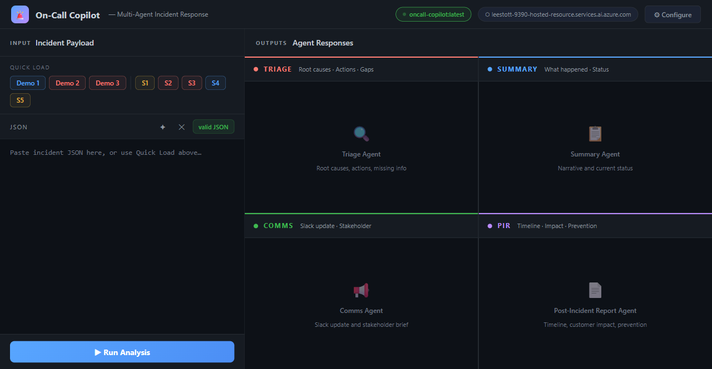

*The empty state. Quick-load buttons at the top left pre-populate the JSON editor with any of the 3 demo incidents or 5 scenario files.*

### Loading an Incident

Click a quick-load button and the JSON editor fills instantly with the full incident payload, a severity badge appears, and the editor validates the JSON in real time.


*The quick-load panel: 3 demo incidents and 5 scenario files ready to load.*

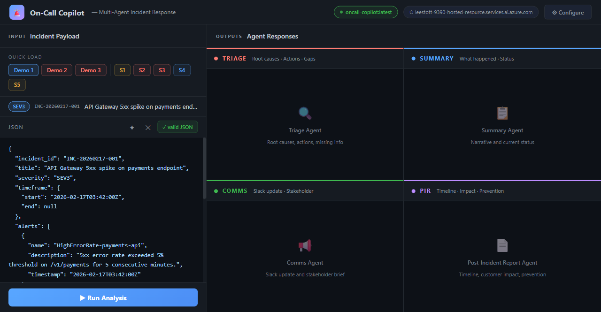

*Demo 1 loaded: API Gateway 5xx spike, SEV3. The JSON is editable, so you can modify any field before submitting.*

### Running the Analysis

Hit **▶ Run Analysis** (or Ctrl+Enter). The four output panels switch to a skeleton loading state while the live Foundry request is in flight (~8 seconds for a complex incident).

### Results: All Four Agents

When the response arrives, all four panels populate simultaneously:

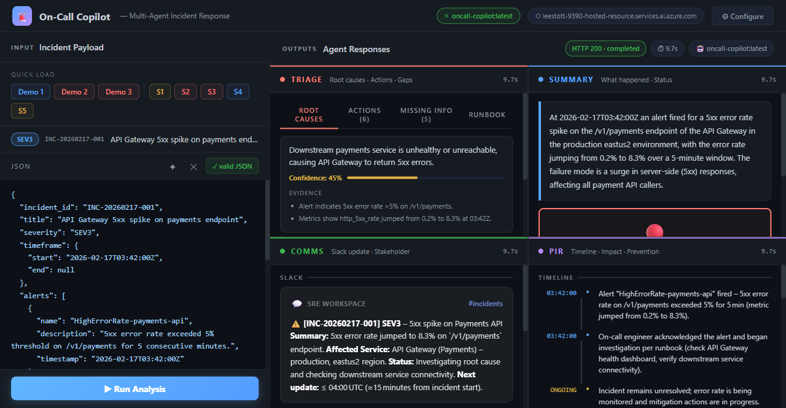

*All four panels populated: Triage (red), Summary (blue), Comms (green), PIR (purple).*

#### Triage Panel

Root causes are ranked by confidence. Evidence is collapsed under each hypothesis. The Actions tab shows immediate steps with priority badges (P0/P1/P2) and owner roles.

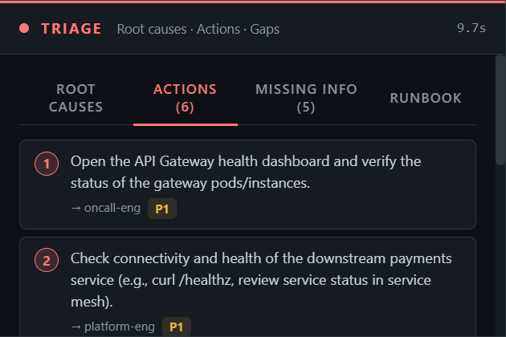

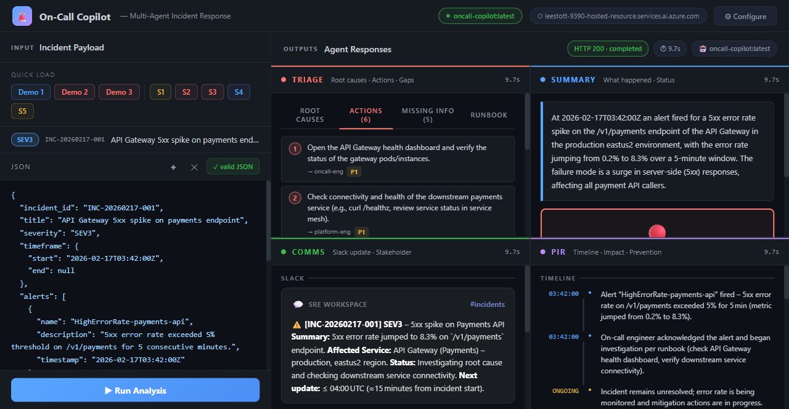

#### Summary Panel

A plain-language narrative paragraph followed by an ONGOING / RESOLVED status box. If the input incident has metrics, key values are shown below.

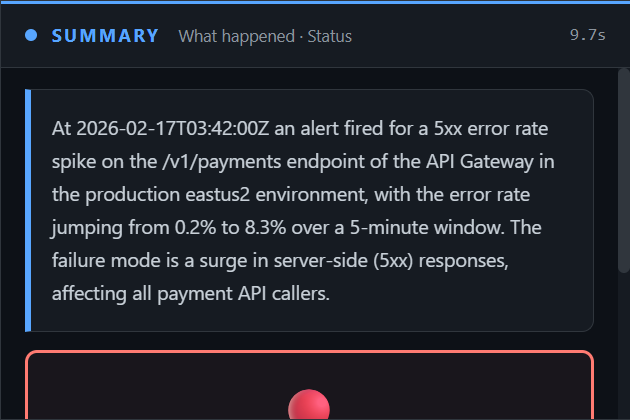

#### Comms Panel

The Slack card renders the `slack_update` field with Slack emoji substitution and bold text markup. The stakeholder card shows the executive summary with a blue left border.

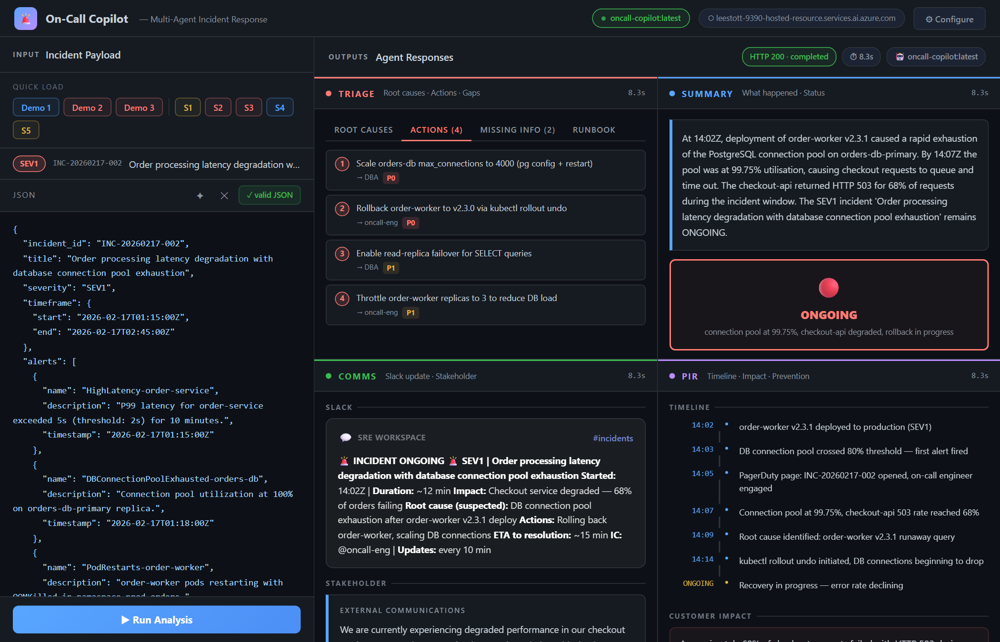

#### Post-Incident Report Panel

The PIR timeline uses a vertical dot-and-line layout. An ONGOING event pulses in yellow. Customer impact is shown in a red-bordered box, followed by numbered prevention actions.

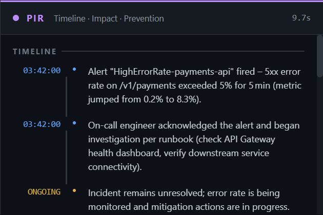

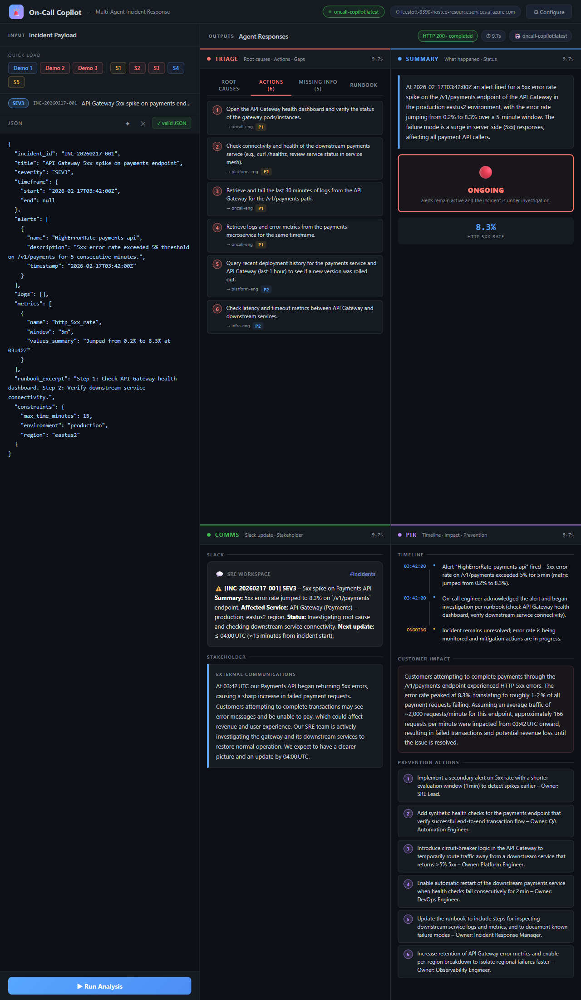

### Starting the UI

```powershell
# Windows PowerShell
$env:AZURE_AI_PROJECT_ENDPOINT = "https://<account>.services.ai.azure.com/api/projects/<project>"
$env:AGENT_NAME = "oncall-copilot"
.\.venv\Scripts\python.exe ui\server.py
# → open http://localhost:7860
```

```bash
# Bash
export AZURE_AI_PROJECT_ENDPOINT="https://<account>.services.ai.azure.com/api/projects/<project>"
export AGENT_NAME="oncall-copilot"
python ui/server.py
```

The server uses Python's stdlib `http.server` plus `requests` and `python-dotenv` — both are already in `requirements.txt`.

---

## Deployment

### Option A: `azd up` (90 seconds)

The repo includes `azure.yaml` and `agent.yaml`, so deployment is a single command:

```bash
azd up
```

This provisions the Foundry project resources, builds the Docker image, pushes to Azure Container Registry, deploys a Model Router instance, and creates the Hosted Agent. The `agent.yaml` defines the agent name, protocols, and environment variable bindings; `azure.yaml` configures the container resources, scaling, and model deployments.

### Option B: Python SDK deploy script

```bash
export ACR_IMAGE="<your-registry>.azurecr.io/oncall-copilot:v1"
export MODEL_ROUTER_DEPLOYMENT="model-router"

# Build and push (must be linux/amd64)
docker build --platform linux/amd64 -t oncall-copilot:v1 .
docker tag oncall-copilot:v1 $ACR_IMAGE
docker push $ACR_IMAGE

# Create the hosted agent
python scripts/deploy_sdk.py
```

The deploy script handles creating the capability host, registering the container, and waiting for the `Started` status.

---

## Five Key Design Decisions

### 1. Parallel over sequential

Running the four agents concurrently cuts total latency by 3–4×. A SEV1 incident with full context takes ~8 seconds; sequentially it would take ~30 seconds. `asyncio.gather()` is the right primitive here: each agent is independent and can process the full incident payload in isolation.

### 2. JSON-only agent instructions

Every agent is instructed to return *only* valid JSON with a defined schema. This makes the output trivially mergeable; the orchestrator just does `merged.update(agent_output)` for each response. No parsing, no extraction, no post-processing.

### 3. No hardcoded model names

`AZURE_OPENAI_CHAT_DEPLOYMENT_NAME=model-router` is the only model reference in the codebase. Model Router handles the gpt-4o vs gpt-4o-mini vs o3-mini decision at runtime based on prompt complexity. When new models are released to Model Router, the agent gets better for free.

The models selected by Model Router and associated costs
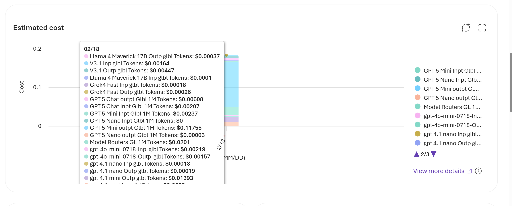

Model Router Insights and Telemetry from Microsoft Foundry
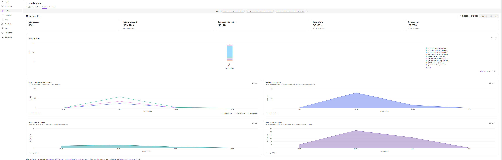

### 4. `DefaultAzureCredential` everywhere

No API keys. No token management code. The hosted container uses a managed identity. Local development uses the `az login` session. The same code runs in both environments without modification.

### 5. Separation of instructions from code

Each agent's system prompt is a plain Python string in `app/agents/<name>.py`. This means a non-developer can refine agent behaviour by editing a text file and redeploying, with no Python knowledge needed.

---

## Guardrails Built Into the Prompts

The agent instructions include explicit guardrails that don't require external filtering:

- **No hallucination**: when data is insufficient, the agent sets `confidence: 0` and adds entries to `missing_information` rather than inventing facts.
- **Secret redaction**: each agent is instructed to redact credential-like patterns as `[REDACTED]` in its output.
- **Mark unknowns**: undeterminable fields use the literal string `"UNKNOWN"` rather than plausible-sounding guesses.
- **Diagnostic suggestions**: when signal is sparse, `immediate_actions` includes diagnostic steps that will gather the missing information before prescribing a fix.

---

## Response Rate: What to Expect

| Incident type | Complexity | Typical latency |
|---|---|---|
| Single alert, minimal context (SEV4) | Low | 4–6 s |
| Multi-signal, logs + metrics (SEV2) | Medium | 7–10 s |
| Full SEV1 with long log lines | High | 10–15 s |
| Post-incident synthesis (resolved) | High | 10–14 s |

For comparison: running the four agents sequentially on a SEV1 incident would take approximately 30–40 seconds. Concurrent execution brings this under 15 seconds for all tested scenarios.

---

## Getting Started

```bash
# Clone
git clone https://github.com/microsoft-foundry/oncall-copilot
cd oncall-copilot

# Install
python -m venv .venv
source .venv/bin/activate  # or .venv\Scripts\activate on Windows
pip install -r requirements.txt

# Set env vars (Foundry project endpoint + Model Router deployment)
export AZURE_OPENAI_ENDPOINT="https://<account>.openai.azure.com/"
export AZURE_OPENAI_CHAT_DEPLOYMENT_NAME="model-router"
export AZURE_AI_PROJECT_ENDPOINT="https://<account>.services.ai.azure.com/api/projects/<project>"

# Validate schemas locally without Azure (mock mode)
MOCK_MODE=true python scripts/validate.py

# Deploy to Foundry
azd up

# Invoke the deployed agent
python scripts/invoke.py --demo 1

# Start the browser UI
python ui/server.py
```

Full documentation is in the [README](../README.md). Agent configuration reference is in [docs/CONFIGURATION.md](CONFIGURATION.md).

---

## What's Next

A few natural extensions:

- **Webhook integration**: a thin adapter that accepts PagerDuty, OpsGenie, or Datadog webhook payloads and converts them to the incident envelope schema before forwarding to the agent.
- **Ticket auto-creation**: add a fifth agent (post-resolution) that creates a Jira or Azure DevOps ticket from the PIR output.
- **Human-in-the-loop**: surface the `missing_information` list back to the on-call engineer as a form before proceeding, so the agent can re-run with the gaps filled.
- **Feedback loop**: track confidence vs actual root cause accuracy over time; use the delta to improve agent instructions.

## Resources

- [Microsoft Agent Framework](https://learn.microsoft.com/agent-framework/) — the SDK powering the multi-agent orchestration
- [Model Router](https://learn.microsoft.com/azure/ai-foundry/openai/how-to/model-router?view=foundry&preserve-view=true) — automatic model selection based on prompt complexity
- [Foundry Hosted Agents](https://learn.microsoft.com/azure/ai-foundry/agents/how-to/deploy-hosted-agent) — deploying containerised agents on Azure AI Foundry
- [ConcurrentBuilder Pattern](https://github.com/microsoft-foundry/foundry-samples) — the agents-in-workflow sample this project follows
- [DefaultAzureCredential](https://learn.microsoft.com/python/api/azure-identity/azure.identity.defaultazurecredential) — the zero-config auth chain used throughout
- [Hosted Agents Concepts](https://learn.microsoft.com/azure/ai-foundry/agents/concepts/hosted-agents?view=foundry) — architecture overview of Foundry Hosted Agents

---

*The On-Call Copilot sample is open source under the MIT licence. Contributions, scenario files, and agent instruction improvements are welcome via pull request.*
